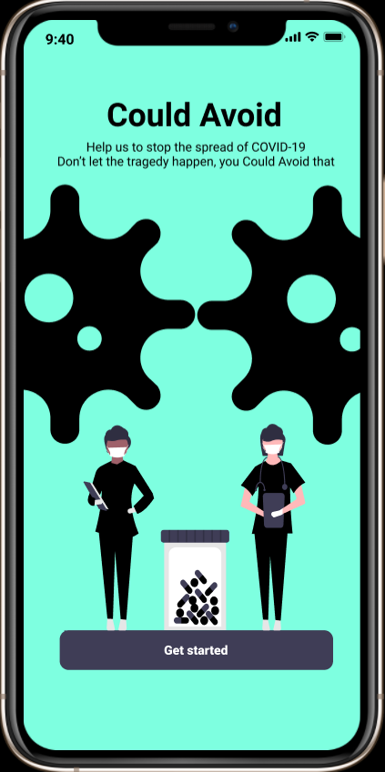
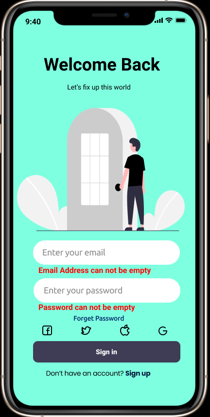
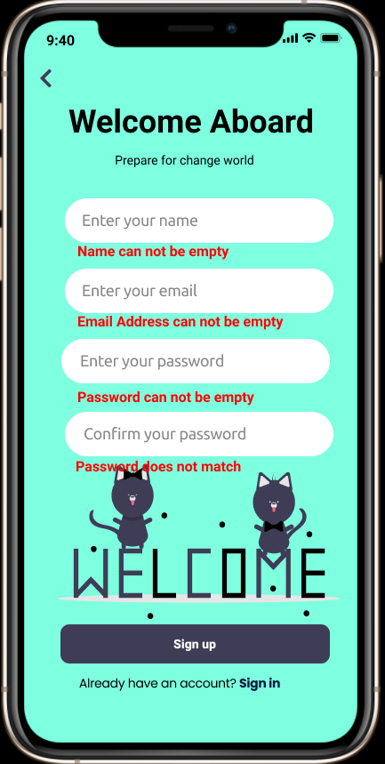
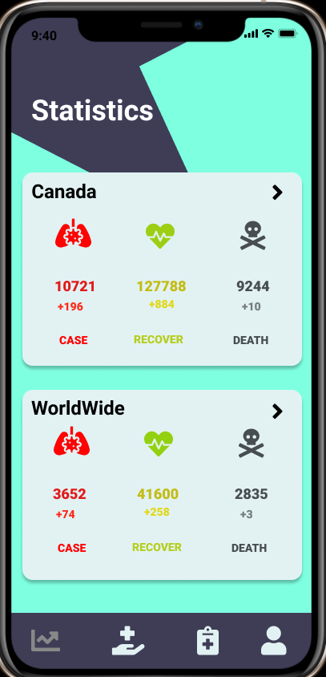
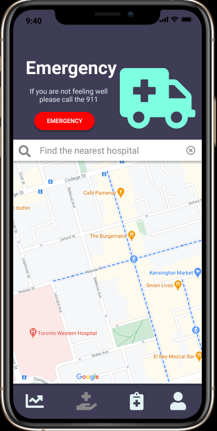
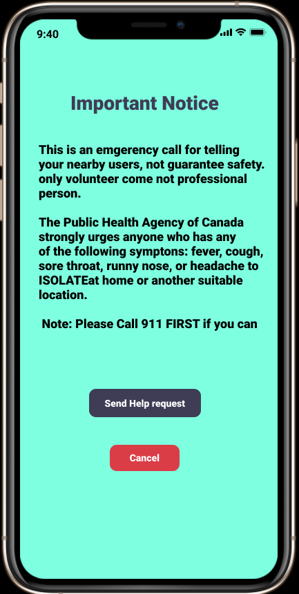
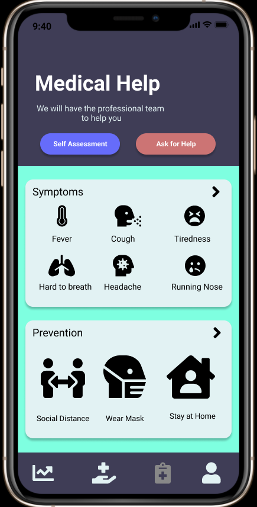
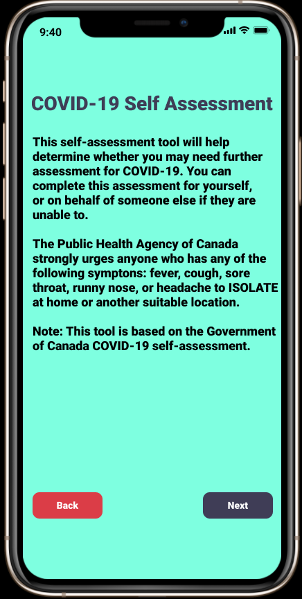
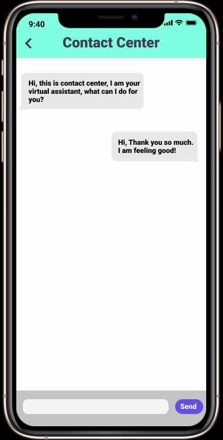
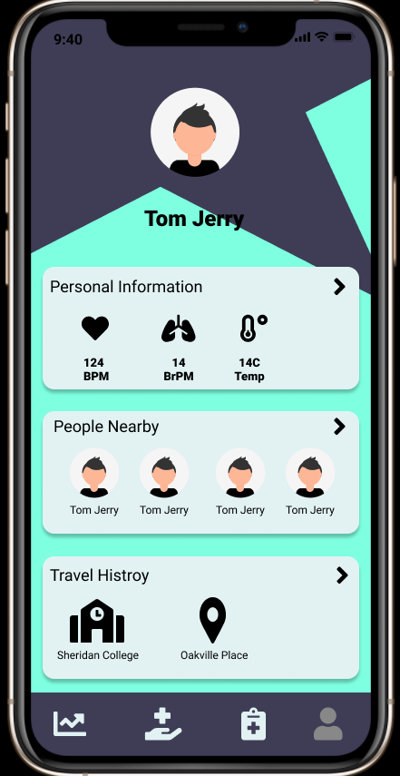

# Could-Avoid

## Top 5 desirable functionalities:
1.	Map search hospital
2.	Online chat
3.	Scan users nearby
4.	Personal Information capture
5.	Place traveled

## Start Page		
  This is the start page for the App, it contains the title of the app and short description.
  
## Sign in 		
  This is the Login page, it has email input and password input, or user can choose social media to simple login. For new users, they can just click Sign up to jump to Sign up       page.
  
  
## Sign up
  This is the registration page, simply creating new account by entering these information.
  
## Statistics			
  This is the Statistics page, include Canada data and worlwide data.
  
  
## Map				
  This is the Map view for users to search the nearest hospital. 
  
  
## Help  
  Emergency situation only, users can ask nearby users for help.
  
  
## Symptoms		
  Showing some common symptoms and latest news about COVID.
  
  
## Self-Assessment		
  Serveral question about COVID-19, user can do this to identify their status (Not guarantee).
  
## Contact Center 
  Users can chat with our AI for some common question, or with our user assistant for specific question.
  
## Profile (Personal Info, People Nearby, Travel History) 
  Users' personal Information, can be modified. See the place traveled recetly and people nearby.
  
## Walkthrough Video:
https://youtu.be/C1NZEqOZ6I0
